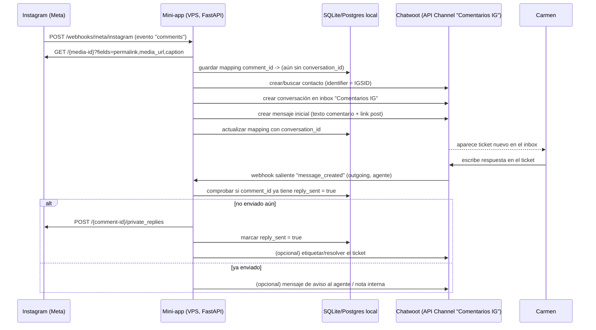

# Especificación técnica: Comentarios de Instagram → Chatwoot

## 1. Objetivo

Cuando alguien comenta en una publicación de Instagram de la cuenta de negocio de Marina, el
comentario debe aparecer como un ticket en un inbox nuevo de Chatwoot ("Comentarios IG"),
con el texto del comentario, el link (y opcionalmente miniatura) de la publicación, y el
usuario que comentó. Carmen contesta ese ticket **desde Chatwoot**, y esa respuesta se envía
automáticamente como un DM privado a la persona (mecanismo "private reply" de Meta), sin que
Carmen tenga que salir de Chatwoot ni ir manualmente al perfil de Instagram.

Restricción dura impuesta por Meta: **solo se puede mandar un private reply por comentario,
para siempre**. Si la clienta responde a ese DM, la respuesta entra por el inbox nativo de
Instagram DM que ya existe en Chatwoot (no por este inbox nuevo).

No debe generar coste recurrente de terceros: todo corre en la VPS que ya gestionáis (mismo
host donde vive Mautic y el webhook de Stripe).

## 2. Arquitectura (resumen)



## 3. Componentes

### 3.1 App de Meta y permisos

- Reutilizar la misma Meta App usada para el canal de Instagram DM ya conectado en Chatwoot
  (mismo `app_id`/`app_secret`), si ya pasó App Review para mensajería.
- Permisos adicionales necesarios:
  - `instagram_manage_comments` — leer, responder y moderar comentarios.
  - `instagram_manage_messages` — ya debería estar si el canal DM funciona; es el que
    habilita `private_replies`.
  - `instagram_business_basic` — metadata básica de la cuenta/usuario.
  - `pages_read_engagement` — si la integración sigue pasando por la Página de Facebook
    vinculada (dependiendo de si usáis Instagram Business Login o Facebook Login for
    Business; confirmar cuál de los dos se usó al montar el canal DM).
- Probable necesidad de volver a pasar **App Review** de Meta para el permiso nuevo. Cuenta
  con que puede tardar de días a un par de semanas y pedir verificación de negocio.

### 3.2 Suscripción al webhook de Meta

Suscribir el campo `comments` (además de los que ya tengáis) vía:

```
POST https://graph.facebook.com/v21.0/{app-id}/subscriptions
{
  "object": "instagram",
  "callback_url": "https://<tu-dominio>/webhooks/meta/instagram",
  "verify_token": "<VERIFY_TOKEN>",
  "fields": ["comments"]
}
```

Payload de ejemplo que llega en el webhook cuando hay un comentario nuevo:

```json
{
  "object": "instagram",
  "entry": [
    {
      "id": "{ig-business-account-id}",
      "time": 1234567890,
      "changes": [
        {
          "field": "comments",
          "value": {
            "id": "{comment-id}",
            "text": "Me encanta, ¿tenéis plazas para el curso?",
            "from": { "id": "{igsid}", "username": "cliente_ejemplo" },
            "media": { "id": "{media-id}" }
          }
        }
      ]
    }
  ]
}
```

Notas para la implementación:
- El endpoint `GET /webhooks/meta/instagram` debe responder al *handshake* de verificación
  (`hub.mode`, `hub.verify_token`, `hub.challenge`).
- El endpoint `POST` debe **validar la firma** `X-Hub-Signature-256` con el `app_secret`
  antes de procesar nada.
- Responder `200` lo antes posible (idealmente <2s) y procesar el resto de forma asíncrona
  (cola simple o `BackgroundTasks` de FastAPI) para no bloquear reintentos de Meta.
- Filtrar: solo nos interesan comentarios de nivel raíz en publicaciones propias, no
  respuestas a otros comentarios (comprobar si el payload trae `parent_id`) — a decidir si
  Marina también quiere tickets para respuestas anidadas o no.

### 3.3 Servicio intermedio (mini-app)

Recomendación: FastAPI (Python), un único servicio con dos endpoints principales:

- `POST /webhooks/meta/instagram` — entrante desde Meta (comentarios nuevos).
- `POST /webhooks/chatwoot/outgoing` — entrante desde Chatwoot (mensajes salientes de agente).

Responsabilidades:
1. Verificar firmas de ambos webhooks.
2. Enriquecer el comentario con datos del post (`permalink`, `media_url`, `caption`) vía
   `GET /{media-id}?fields=permalink,media_url,caption,media_type`.
3. Crear/actualizar contacto y conversación en Chatwoot.
4. Persistir el mapping `comment_id ↔ conversation_id ↔ reply_sent` (ver 4).
5. Al recibir respuesta de Carmen, comprobar guardrail y llamar a `private_replies`.
6. Manejar errores de Meta (comentario caducado a los 7 días, ya respondido, cuenta
   bloqueada, etc.) y reflejarlos como nota interna en el ticket de Chatwoot para que Carmen
   sepa qué pasó.

### 3.4 Integración con Chatwoot — Inbox "Comentarios IG"

Crear un **Inbox tipo API** dedicado (Settings → Inboxes → Add Inbox → API), distinto del
inbox nativo de Instagram DM. Guardar su `inbox_id` y el `api_access_token` (Profile →
Access Token de un usuario de servicio, o token de la cuenta) en las variables de entorno
del servicio.

Flujo de creación de ticket (usar la Application API de Chatwoot, headers
`api_access_token: <token>`):

```
POST /api/v1/accounts/{account_id}/contacts
{
  "inbox_id": "<inbox_id_comentarios>",
  "name": "cliente_ejemplo",
  "identifier": "{igsid}"          // clave para luego cruzar con el inbox de DM nativo
}
→ devuelve contact_id y, en contact_inboxes[0], el source_id de la sesión

POST /api/v1/accounts/{account_id}/conversations
{
  "source_id": "<source_id>",
  "inbox_id": "<inbox_id_comentarios>",
  "contact_id": "<contact_id>"
}
→ devuelve conversation_id

POST /api/v1/accounts/{account_id}/conversations/{conversation_id}/messages
{
  "content": "💬 Nuevo comentario de @cliente_ejemplo en [ver publicación](<permalink>):\n\n\"Me encanta, ¿tenéis plazas para el curso?\"",
  "message_type": "incoming"
}
```

Puntos a decidir:
- **Contacto único por IGSID**: usar el mismo `identifier` que use (o vaya a usar) el canal
  nativo de Instagram DM, para que Chatwoot enlace ambos historiales bajo el mismo contacto
  aunque estén en inboxes distintos.
- **Adjuntar imagen del post**: además del link, se puede subir el `media_url` como
  attachment del mensaje si queréis que Carmen vea la foto sin salir de Chatwoot (llamada
  adicional con `multipart/form-data` a la API de mensajes). Es opcional, más peso de
  desarrollo — recomendaría empezar solo con el link y añadirlo después si hace falta.
- **Etiquetas/labels**: aplicar una label `ig-comentario` al crear la conversación, para
  poder filtrar/reportar aparte del inbox de DMs.

### 3.5 Webhook saliente de Chatwoot

Configurar en Chatwoot: Settings → Integrations → Webhooks → añadir
`https://<tu-dominio>/webhooks/chatwoot/outgoing`, evento `message_created`.

Payload relevante (simplificado):

```json
{
  "event": "message_created",
  "message_type": "outgoing",
  "content": "¡Hola! Sí, todavía quedan plazas, te escribo por privado 😊",
  "conversation": { "id": 123, "inbox_id": "<inbox_id_comentarios>" },
  "sender": { "type": "user", "name": "Carmen" }
}
```

El servicio debe:
1. Ignorar eventos que no sean `message_type: "outgoing"` (para no reaccionar a los propios
   mensajes creados por el bot al generar el ticket) y que no vengan del inbox
   "Comentarios IG" (para no interferir con el inbox de DM nativo).
2. Buscar en la base local el `comment_id` asociado a esa `conversation.id`.
3. Comprobar el guardrail (ver 6).
4. Llamar a Instagram:

```
POST https://graph.facebook.com/v21.0/{comment-id}/private_replies
{
  "message": "¡Hola! Sí, todavía quedan plazas, te escribo por privado 😊"
}
```

5. Marcar `reply_sent = true` en la base local.
6. Opcional: mover el ticket a "resuelto" o añadir nota interna confirmando el envío.

## 4. Modelo de datos local

Suficiente con SQLite si el volumen es bajo (coherente con "lightweight"); migrar a
Postgres solo si ya tenéis uno corriendo para otra cosa en la VPS.

```sql
CREATE TABLE ig_comment_tickets (
    id                  INTEGER PRIMARY KEY AUTOINCREMENT,
    comment_id          TEXT UNIQUE NOT NULL,
    media_id            TEXT NOT NULL,
    igsid               TEXT NOT NULL,
    username             TEXT,
    permalink           TEXT,
    comment_text        TEXT,
    chatwoot_contact_id  INTEGER,
    chatwoot_conversation_id INTEGER,
    reply_sent          BOOLEAN DEFAULT FALSE,
    reply_sent_at        TIMESTAMP,
    created_at           TIMESTAMP DEFAULT CURRENT_TIMESTAMP,
    comment_created_at   TIMESTAMP   -- para calcular la ventana de 7 días
);
```

## 5. Reglas de negocio / guardrails

- **Un private reply por comentario, para siempre.** Antes de llamar a
  `private_replies`, comprobar `reply_sent`. Si ya es `true`, no reintentar; dejar una nota
  interna en Chatwoot tipo *"Ya se envió un privado para este comentario. Si necesitas
  seguir hablando con esta persona, hazlo por DM normal."* y, si se puede, bloquear el campo
  de texto del ticket (o simplemente resolver el ticket automáticamente tras el primer
  envío exitoso, que es más simple de implementar).
- **Ventana de 7 días.** Si `now - comment_created_at > 7 días`, el `private_replies` de
  Meta devolverá error. Capturarlo y avisar a Carmen vía nota interna sugiriendo contestar
  por DM normal si el contacto ya existe en esa vía.
- **Comentarios que no son de clientas** (spam, bots, comentarios propios de la cuenta):
  decidir si se filtran antes de crear ticket. Se puede empezar sin filtro y añadir reglas
  luego (por longitud, palabras clave, etc.) si el volumen de spam lo justifica.
- **Idempotencia del webhook de Meta**: Meta puede reenviar el mismo evento; usar
  `comment_id` como clave única (`UNIQUE` en la tabla) para no duplicar tickets.

## 6. Seguridad

- Verificar `X-Hub-Signature-256` en el webhook de Meta con el `app_secret` (HMAC-SHA256
  sobre el body crudo).
- Verificar la firma del webhook saliente de Chatwoot (Chatwoot genera un secreto por API
  channel al crearlo; usarlo para validar el payload).
- Servicio expuesto solo vía HTTPS (reverse proxy ya existente en la VPS, mismo patrón que
  el webhook de Stripe).
- Guardar `app_secret`, `access_token` de Instagram y `api_access_token` de Chatwoot como
  variables de entorno / secretos, nunca en el repo.

## 7. Variables de entorno

```
META_APP_ID=
META_APP_SECRET=
META_VERIFY_TOKEN=
IG_LONG_LIVED_ACCESS_TOKEN=
CHATWOOT_BASE_URL=
CHATWOOT_ACCOUNT_ID=
CHATWOOT_API_ACCESS_TOKEN=
CHATWOOT_INBOX_ID_COMENTARIOS=
CHATWOOT_WEBHOOK_SECRET=
DATABASE_URL=sqlite:///./ig_comments.db
```

## 8. Despliegue en la VPS

- Un servicio más en Docker (o proceso systemd) junto a Mautic y el webhook de Stripe.
- Reverse proxy (el que ya uséis, p. ej. Caddy/Nginx) apuntando un subdominio o subruta al
  puerto del nuevo servicio.
- Logs con nivel suficiente para depurar el primer mes (comentario recibido, ticket creado,
  private reply enviado/fallido) — importante mientras se ajusta el guardrail del
  "una sola vez".

## 9. Requisitos de Meta App Review

Antes de poder recibir comentarios de webhooks y usar `private_replies` en producción con
cuentas de terceros necesitáis (o si sois vosotros mismos la cuenta de Marina, puede que
baste con modo desarrollo, a confirmar):
- Solicitar permisos `instagram_manage_comments` (y confirmar que
  `instagram_manage_messages` sigue activo).
- Preparar capturas/vídeo de demo del flujo para el formulario de revisión (Chatwoot tiene
  su propia plantilla de Instagram App Review que podéis adaptar:
  `developers.chatwoot.com/self-hosted/instagram-app-review`).
- Verificación de negocio si no la tenéis ya hecha para la app.

## 10. Pruebas

- Usar el "Test" del panel de Meta for Developers para disparar eventos de webhook
  simulados de `comments` antes de tener tráfico real.
- Entorno de desarrollo: ngrok o similar para exponer el servicio local mientras se
  itera, luego mover a la VPS.
- Probar explícitamente: comentario duplicado (reenvío de Meta), segundo mensaje de Carmen
  en el mismo ticket tras ya haber enviado el private reply, comentario con más de 7 días.

## 11. Limitaciones conocidas (a comunicar a Marina/Carmen)

- Un solo privado por comentario, para siempre — no es un chat continuo desde ese ticket.
- Si la clienta responde al privado, la conversación sigue en el inbox de Instagram DM
  normal, no en "Comentarios IG" (aunque el contacto sea el mismo si se usa el mismo
  `identifier`).
- Comentarios de más de 7 días no se pueden contestar por privado desde este flujo.

## 12. Decisiones abiertas para resolver iterando en Claude Code

1. ¿Filtrar comentarios en respuestas anidadas (`parent_id`) o crear ticket para todos?
2. ¿Adjuntar la imagen del post como attachment o basta con el link?
3. ¿Auto-resolver el ticket tras enviar el private reply, o dejarlo abierto con una nota?
4. ¿SQLite o reutilizar una base de datos existente en la VPS?
5. Confirmar si el canal de Instagram DM actual se montó con Instagram Business Login o vía
   Facebook Login for Business, para saber qué token reutilizar y si hace falta re-consentir
   permisos.